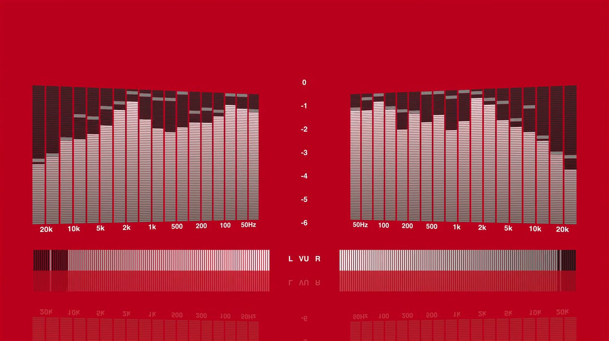

# LED Spectrum Analyser

A hi-fi style LED spectrum analyser visualizer for **Apple Music** and **iTunes**, originally created by Graham Cox
(Apptree). This is a 64-bit, universal rebuild that recreates the look and behaviour of Graham's last release,
3.0.7, and runs natively on Apple Silicon.



## Features

- Segmented LED bars with peak hold, in 10, 18, 24 or 31 log-spaced bands
- Three layouts: side by side, back to back, and analogue VU meters
- VU bargraphs, perspective, reflections, glowing track info, progress bar and cover art
- Colours of your choice, colours taken from the cover art, randomised or slowly animating
- Up to ten user presets
- The same options window, keyboard shortcuts and on-screen messages as 3.0.7

## Compatibility

| Host | Mac | Runs as |
|---|---|---|
| Apple Music (macOS 11 or later) | Apple Silicon | native arm64 |
| Apple Music (macOS 10.15 or later) | Intel | native x86_64 |
| iTunes 10.4 or later, including iTunes 10.7 installed with [Retroactive](https://github.com/cormiertyshawn895/Retroactive) | Apple Silicon or Intel | x86_64 (under Rosetta on Apple Silicon) |

The bundle contains both architectures, so the same download works everywhere.

## Installation

1. Download `LED-Spectrum-Analyser.zip` from the [Releases](../../releases) page and unzip it, or build it yourself
   (see below).
2. Quit Music and iTunes.
3. Copy `LED Spectrum Analyser.bundle` into `~/Library/iTunes/iTunes Plug-ins/` (create the folder if it doesn't
   exist). Music and iTunes both load visualizers from this folder.
4. The bundle is not notarised, so remove the download quarantine flag:

   ```sh
   xattr -dr com.apple.quarantine ~/Library/iTunes/iTunes\ Plug-ins/LED\ Spectrum\ Analyser.bundle
   ```

5. Open Music or iTunes, show the visualizer (**Window › Visualizer** in Music, **View › Show Visualizer** in iTunes)
   and choose **LED Spectrum Analyser** from the Visualizer menu.

The original 3.0.7 can stay installed alongside this version: it appears in the menu as "LED Spectrum Analyser
(3.0)". To remove a visualizer, move its bundle out of the plug-ins folder; renaming it inside the folder is not
enough.

## Usage

Press `d` or right-click the visualizer for the options window. Most options also have a single-key shortcut,
listed in the manual: [`resources/manual.html`](resources/manual.html), which also opens from the right-click menu.

### Apple Music

Music sends visualizers different data from iTunes, which made the bars sit near the top. Music's spectrum and
waveform data run about twice the level iTunes sends for the same track, so in Music the visualizer halves them.
Music also keeps sending its last block of audio data while paused, so data that stops changing is treated as
silence. Both of these also affect the original 3.0.7.

Press `=` for a diagnostics overlay showing the data the host sends. **Spectrum Gain** (Options › Advanced) adjusts
the level further. Settings are kept separately for Music and iTunes; presets are shared.

## Building from source

Requires macOS with the Xcode command line tools (`xcode-select --install`). No Xcode project is needed.

```sh
make            # universal bundle in build/
make test       # unit tests for the platform-neutral core (also runs on Linux)
make harness    # loads the bundle in a fake host and saves screenshots to build/screenshots
make install    # copies the bundle to ~/Library/iTunes/iTunes Plug-ins
make zip        # build/LED-Spectrum-Analyser.zip
```

### Source layout

| Path | Contents |
|---|---|
| `src/core/` | Platform-neutral C++: settings, band mapping, meter ballistics, layout, colours, presets |
| `src/mac/` | Plug-in entry point, Core Animation renderer, options window |
| `sdk/` | Apple's iTunes Visual Plug-in SDK 2.0 headers |
| `tests/` | Unit tests and the host test harness |
| `resources/` | Info.plist and the manual |
| `legacy/` | Graham Cox's original 2.0.6 source, unchanged |

## History

Graham Cox wrote LED Spectrum Analyser for iTunes between 1999 and 2014. Before his website went offline he released
the source of version 2.0.6, which Isaac Halvorson preserved on GitHub. The 2.x code uses Carbon and QuickDraw, which
don't exist in 64-bit macOS, and the 3.x source was never published. This version is therefore a new implementation,
built from 3.0.7's behaviour, documentation and screenshots, reusing Graham's band-mapping code.

## Credits and copyright

- **LED Spectrum Analyser** © 1999–2014 Graham Cox, Apptree. The original design, artwork and 2.0.6 source code
  (in [`legacy/`](legacy/)) are his.
- **Source archive** preserved by Isaac Halvorson ([hisaac/LED-Spectrum-Analyser](https://github.com/hisaac/LED-Spectrum-Analyser)),
  from which this repository is forked.
- **64-bit rebuild** by Noah Batiz.
- **iTunes Visual Plug-in SDK** headers © 2000–2011 Apple Inc.

No licence was published with the original source, and all rights to it remain with Graham Cox. This project is not
affiliated with Graham Cox, Apptree or Apple.
